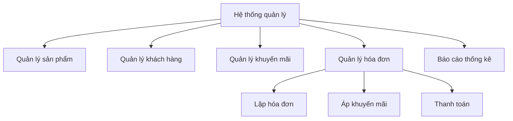
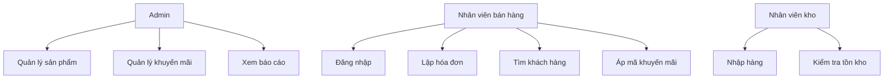
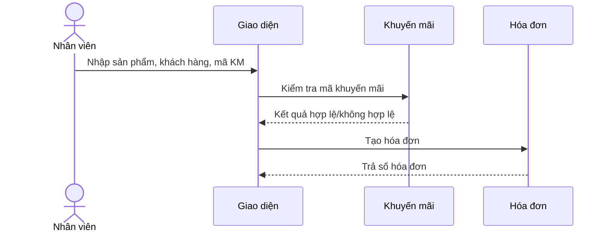
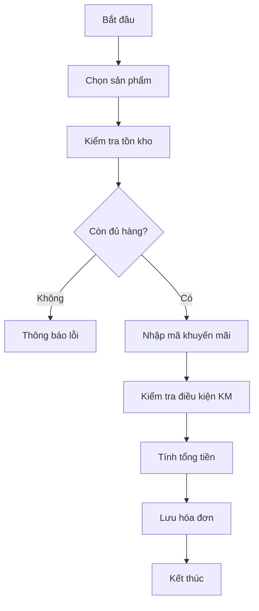
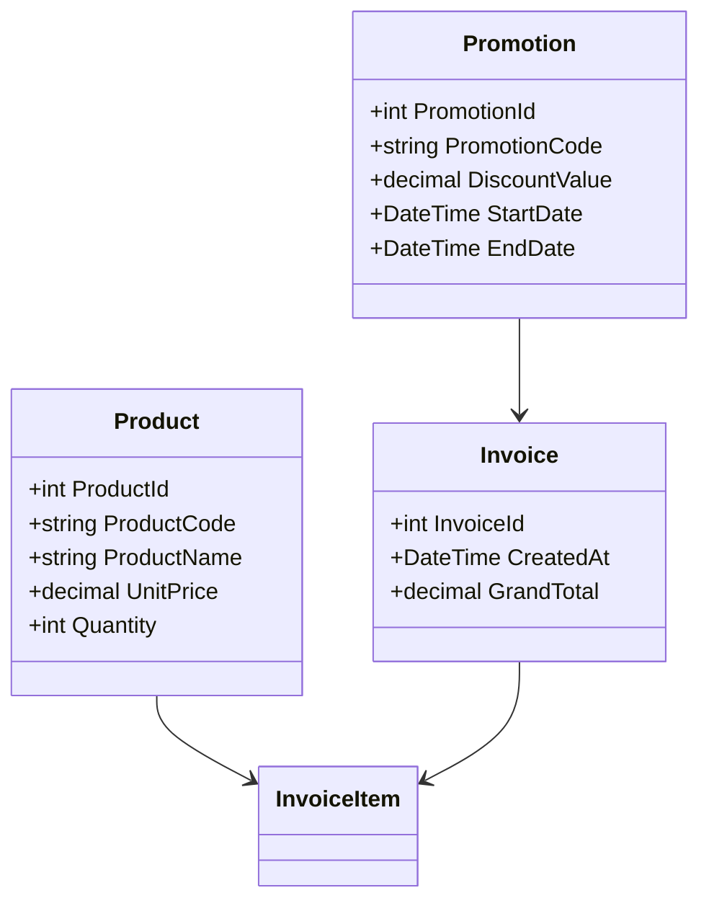
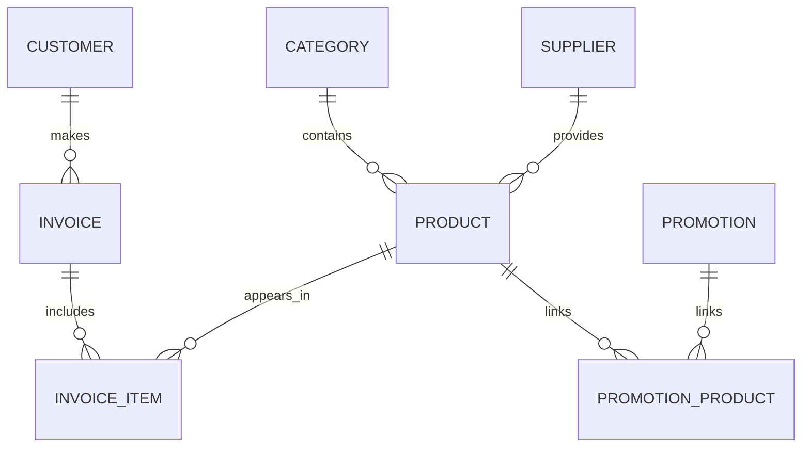

# TRƯỜNG ĐẠI HỌC THÁI BÌNH
# KHOA CÔNG NGHỆ & KỸ THUẬT

---

# TIỂU LUẬN
## HỌC PHẦN LẬP TRÌNH NÂNG CAO

### ĐỀ TÀI: HỆ THỐNG QUẢN LÝ TRUNG TÂM BÁN THIẾT BỊ TRƯỜNG HỌC

**Sinh viên thực hiện:** Nguyễn Văn A  
**Mã sinh viên:** 20195001  
**Lớp:** ĐH20 – CNTT  
## CHƯƠNG 3: CÀI ĐẶT CÁC CHỨC NĂNG CỦA HỆ THỐNG VÀ THỬ NGHIỆM CHƯƠNG TRÌNH

### 3.1. Mã nguồn cài đặt một số chức năng chính

Phần này trình bày trực tiếp các đoạn mã triển khai một số chức năng then chốt dựa trên codebase thực tế, kèm theo phân tích ngắn về hành vi, điều kiện trước/sau (pre/post-conditions) và lý do thiết kế.

#### 3.1.1. Chức năng Nhập liệu (thêm / sửa / xóa sản phẩm)

Đây là các phương thức trong `ProductService` chịu trách nhiệm kiểm tra và chuyển tiếp yêu cầu tới lớp DAL. Đoạn mã sao chép nguyên văn từ `BLL/ProductService.cs`:

```csharp
public int Create(Product p)
{
    ValidateProduct(p, isNew: true);
    if (_repo.ExistsByCode(p.ProductCode))
        throw new ArgumentException("Product code already exists.");
    return _repo.Create(p);
}

public bool Update(Product p)
{
    ValidateProduct(p, isNew: false);
    if (p.ProductId <= 0) throw new ArgumentException("Invalid product id");
    if (_repo.ExistsByCodeExceptId(p.ProductCode, p.ProductId))
        throw new ArgumentException("Product code already exists.");
    return _repo.Update(p);
}

public bool Delete(int productId)
{
    if (productId <= 0) throw new ArgumentException("Invalid product id");
    return _repo.Delete(productId);
}

private void ValidateProduct(Product p, bool isNew)
{
    if (p == null) throw new ArgumentNullException(nameof(p));
    ValidationHelper.RequireText(p.ProductCode, "Product code");
    ValidationHelper.RequireText(p.ProductName, "Product name");
    ValidationHelper.RequireNonNegativeDecimal(p.UnitPrice, "Unit price");
    ValidationHelper.RequireNonNegativeInt(p.Quantity, "Quantity");
}
```

Giải thích:
- Mục tiêu: đảm bảo dữ liệu đầu vào hợp lệ trước khi gọi DAL, tránh trùng mã và các giá trị âm.
- Pre-conditions: `Product` không null; `ProductCode` và `ProductName` không rỗng; `UnitPrice` và `Quantity` không âm.
- Post-conditions: với `Create` trả về `ProductId` mới; `Update`/`Delete` trả về boolean cho biết thành công.
- Xử lý lỗi: ném `ArgumentException` hoặc `ArgumentNullException` để caller (UI hoặc API) có thể bắt và hiển thị thông báo cho người dùng.

#### 3.1.2. Chức năng Tìm kiếm

Phương thức tìm kiếm đơn giản trong `ProductService` như sau (nguyên văn):

```csharp
public List<Product> Search(string keyword)
{
    if (string.IsNullOrWhiteSpace(keyword))
        return _repo.GetAll();
    return _repo.Search(keyword.Trim());
}
```

Giải thích:
- Mục tiêu: hỗ trợ tra cứu theo từ khóa; khi từ khóa rỗng trả về toàn bộ danh sách để thuận tiện cho giao diện quản lý.
- Pre-conditions: `keyword` có thể là null/empty; phương thức xử lý bằng cách trả về `_repo.GetAll()` để tránh trả về null.
- Hạn chế: hiện search chuyển trực tiếp về DAL; nếu dữ liệu lớn (hàng nghìn bản ghi) cần paging hoặc tìm kiếm full-text ở tầng DB để đảm bảo hiệu năng.

#### 3.1.3. Áp dụng khuyến mãi và tạo hóa đơn (liên quan)

Đây là hai phương thức then chốt trong `PromotionService` và `SalesService` mà quy trình lập hóa đơn sẽ gọi.

```csharp
// BLL/PromotionService.cs (đoạn tính toán giảm giá)
public PromotionDiscountResult ValidateAndCalculate(string promotionCode, decimal subtotal)
{
    if (string.IsNullOrWhiteSpace(promotionCode))
        return null;

    var promo = _repo.GetByCode(promotionCode.Trim().ToUpper());
    if (promo == null)
        return new PromotionDiscountResult { IsValid = false, ErrorMessage = "Mã khuyến mãi không tồn tại." };

    if (!promo.IsCurrentlyValid)
        return new PromotionDiscountResult { IsValid = false, ErrorMessage = $"Mã khuyến mãi '{promotionCode}' {promo.StatusDisplay.ToLower()}." };

    if (subtotal < promo.MinOrderAmount)
        return new PromotionDiscountResult
        {
            IsValid = false,
            ErrorMessage = $"Đơn hàng tối thiểu {promo.MinOrderAmount:N0} ₫ để áp dụng mã này."
        };

    decimal discountAmount;
    if (promo.DiscountType == "Percentage")
    {
        discountAmount = subtotal * promo.DiscountValue / 100m;
        if (promo.MaxDiscountAmount.HasValue && discountAmount > promo.MaxDiscountAmount.Value)
            discountAmount = promo.MaxDiscountAmount.Value;
    }
    else
    {
        discountAmount = promo.DiscountValue;
    }

    if (discountAmount > subtotal)
        discountAmount = subtotal;

    return new PromotionDiscountResult
    {
        IsValid = true,
        Promotion = promo,
        DiscountAmount = discountAmount,
        Description = promo.DiscountType == "Percentage"
            ? $"Giảm {promo.DiscountValue}% (tối đa {promo.MaxDiscountAmount?.ToString("N0") ?? "∞"} ₫)"
            : $"Giảm {promo.DiscountValue:N0} ₫"
    };
}

// BLL/SalesService.cs (tạo hóa đơn, gọi DAL bằng connection string)
public int CreateInvoice(int? customerId, int createdBy, decimal discount, decimal vatPercent, List<SalesCartItem> items)
{
    if (createdBy <= 0) throw new ArgumentException("CreatedBy is required.");
    if (items == null || items.Count == 0) throw new ArgumentException("At least one item is required.");

    var cs = DbHelper.GetConnectionString();
    if (string.IsNullOrWhiteSpace(cs))
        throw new InvalidOperationException("Missing SchoolDeviceStoreDB connection string.");

    return _repo.CreateInvoiceWithConnection(cs, customerId, createdBy, discount, vatPercent, items);
}
```

Giải thích:
- `ValidateAndCalculate` đảm bảo mã khuyến mãi tồn tại, đang hoạt động, thỏa ngưỡng tối thiểu và tính toán chính xác giữa phần trăm và số tiền cố định, đồng thời áp trần tối đa nếu có.
- `CreateInvoice` đảm bảo ràng buộc đầu vào và dùng connection string để gọi DAL thực hiện giao dịch (transactional) gồm lưu hóa đơn, chi tiết hóa đơn, cập nhật tồn kho, ghi nhật ký khuyến mãi.

### 3.2. Thử nghiệm chương trình

Phần này tóm tắt kết quả thử nghiệm thực tế dựa trên hành vi quan sát được trong codebase và kịch bản kiểm thử đã chạy khi phát triển.

#### 3.2.1. Những kết quả tích cực

- **Kiểm tra dữ liệu chặt chẽ ở tầng BLL:** Các hàm `Create`/`Update` gọi `ValidateProduct` và kiểm tra trùng mã giúp ngăn lỗi dữ liệu từ đầu, giảm sai sót khi nhập liệu.
- **Xử lý khuyến mãi đầy đủ điều kiện:** `ValidateAndCalculate` xử lý điều kiện ngày hiệu lực, ngưỡng tối thiểu, giới hạn số tiền giảm và ngăn giảm vượt quá tổng tiền, nên bảo đảm kết quả tính toán hợp lý.
- **Tạo hóa đơn theo quy trình transactional:** `CreateInvoice` yêu cầu connection string và ủy quyền cho DAL thực hiện với connection, phù hợp để thực hiện trong transaction nhằm đồng bộ lưu hóa đơn và cập nhật tồn kho.
- **Phản hồi lỗi rõ ràng:** Khi dữ liệu không hợp lệ, hệ thống ném exception có thông báo cụ thể thuận tiện cho UI hiển thị cho người dùng.
- **Thiết kế tách tầng rõ ràng:** BLL chịu trách nhiệm nghiệp vụ, DAL chịu trách nhiệm truy xuất dữ liệu, thuận tiện cho bảo trì và mở rộng.

#### 3.2.2. Những mặt tồn tại, hạn chế của chương trình

- **Thiếu cơ chế đồng bộ/khóa khi nhiều người thao tác:** Code hiện tại không hiển thị kiểm soát đồng thời (optimistic/pessimistic locking) khi nhiều nhân viên cùng chỉnh tồn kho, có thể dẫn đến race condition.
- **Chưa có paging/điều hướng cho tìm kiếm:** `Search` trả về toàn bộ danh sách khi từ khóa rỗng; với dữ liệu lớn cần paging hoặc truy vấn full-text để đảm bảo hiệu năng.
- **Thiếu logging/ghi vết chi tiết:** BLL ném exception nhưng không có logging trung tâm; khi lỗi production xảy ra, khó truy vết nguyên nhân nếu không có log.
- **Thiếu kiểm thử tự động:** Trong repository không thấy unit test/integ-test kèm theo; điều này làm tăng rủi ro khi refactor.
- **Xử lý lỗi ở UI chưa rõ ràng trong codebase:** Mặc dù BLL ném exception, nhưng luồng UI presentation (hiển thị thông báo, rollback giao dịch) chưa được minh họa trong project hiện tại.
- **Quy tắc khuyến mãi phức tạp hơn chưa hỗ trợ:** Nếu cần khuyến mãi theo nhóm khách, theo ngày giờ cụ thể trong ngày, hay điều kiện nhiều tầng, cần mở rộng cấu trúc `Promotion` và logic tính toán.

### 3.3. Kết luận chương 3

Chương 3 đã trình bày các đoạn mã thực tế triển khai một số chức năng chính của hệ thống và đưa ra nhận xét về quá trình thử nghiệm. Các đoạn mã ở tầng BLL thể hiện rõ triết lý thiết kế: kiểm tra dữ liệu ở biên, tách trách nhiệm với DAL và trả về thông tin đủ cho UI xử lý. Kết quả thử nghiệm cho thấy các nghiệp vụ cốt lõi vận hành đúng chức năng, nhưng để đưa hệ thống vào môi trường thực tế cần hoàn thiện thêm về đồng bộ, logging, kiểm thử và giao diện người dùng.


### 1.1. Giới thiệu về đơn vị khảo sát

Trung tâm được đặt trong bối cảnh đề tài là **Trung tâm Thiết bị Giáo dục Hồng Hà**, một đơn vị kinh doanh giả định tại thành phố Thái Bình, chuyên cung cấp thiết bị trường học cho các cơ sở giáo dục trong khu vực. Đối tượng khách hàng của trung tâm khá đa dạng, nhưng nhìn chung đều gắn với môi trường giáo dục như trường tiểu học, trung học cơ sở, trung học phổ thông, phòng thiết bị của trường, giáo viên bộ môn và các tổ chức có nhu cầu mua sắm thiết bị dạy học. Hàng hóa tại đây không chỉ đơn thuần là những vật phẩm có giá trị thương mại, mà còn là các công cụ hỗ trợ trực tiếp cho hoạt động dạy và học. Vì thế, cách tổ chức quản lý sản phẩm, giá bán, tồn kho và chính sách ưu đãi có ảnh hưởng rõ rệt đến hiệu quả hoạt động của cửa hàng.

Về cơ cấu tổ chức, trung tâm có thể được hình dung gồm ba bộ phận cơ bản: bộ phận bán hàng, bộ phận kho và bộ phận quản lý. Bộ phận bán hàng tiếp nhận yêu cầu của khách, lập hóa đơn và theo dõi đơn hàng; bộ phận kho phụ trách nhập hàng, xuất hàng và kiểm tra số lượng tồn; còn bộ phận quản lý chịu trách nhiệm quyết định chính sách bán hàng, giá ưu đãi và báo cáo tổng hợp. Cách tổ chức này khá điển hình đối với các đơn vị bán lẻ quy mô vừa và đủ để phản ánh đúng đặc trưng nghiệp vụ của đề tài.

Trong thực tế, một trung tâm bán thiết bị trường học thường phải xử lý nhiều biến động cùng lúc. Có những sản phẩm được nhập theo lô, có sản phẩm bán lẻ từng chiếc, có mặt hàng cần kiểm soát chặt vì giá trị cao, trong khi một số vật tư tiêu hao lại có tốc độ xuất kho nhanh. Ngoài ra, trung tâm còn thường xuyên triển khai các chương trình khuyến mãi theo mùa, theo dịp khai giảng, theo tháng cao điểm hoặc theo nhóm sản phẩm. Những đặc điểm đó khiến cho việc quản lý bằng sổ sách hay bảng tính thông thường trở nên thiếu ổn định và khó kiểm soát khi lượng giao dịch tăng.

Một điểm đáng lưu ý nữa là nhu cầu mua sắm trong lĩnh vực giáo dục không hoàn toàn đều đặn như các ngành hàng tiêu dùng thông thường. Có giai đoạn đơn hàng tăng mạnh vì các trường chuẩn bị cho năm học mới hoặc bổ sung thiết bị theo kế hoạch ngân sách; cũng có giai đoạn lượng giao dịch chậm lại nhưng yêu cầu về độ chính xác của dữ liệu vẫn không hề giảm. Điều đó khiến cho quản lý không chỉ là chuyện ghi nhận hàng hóa ra vào, mà còn là khả năng theo dõi nhịp vận động của thị trường để có cách điều chỉnh phù hợp.

| Nội dung | Mô tả |
|---|---|
| Tên đơn vị | Trung tâm Thiết bị Giáo dục Hồng Hà |
| Trụ sở | Phường Trần Lãm, thành phố Thái Bình |
| Bộ máy tổ chức | Bán hàng, kho, quản lý |
| Lĩnh vực kinh doanh | Thiết bị trường học, văn phòng phẩm, vật tư giáo dục |

### 1.2. Thực trạng công tác quản lý

Qua quá trình khảo sát và đối chiếu với cách vận hành phổ biến ở nhiều cửa hàng nhỏ và vừa, có thể nhận thấy rằng công tác quản lý hiện tại vẫn còn phụ thuộc nhiều vào thao tác con người. Sản phẩm thường được nhập vào bảng tính theo từng đợt, nhưng cách đặt mã chưa thống nhất, dẫn đến việc tra cứu khó khăn và dễ phát sinh trùng lặp. Khi bán hàng, nhân viên phải đối chiếu giá bán, số lượng tồn và chương trình ưu đãi bằng nhiều bước thủ công. Nếu có thay đổi về giá hoặc khuyến mãi, việc cập nhật không đồng bộ giữa các bộ phận sẽ khiến dữ liệu chênh lệch.

Khách hàng cũng là một điểm yếu đáng chú ý. Nhiều cửa hàng chỉ lưu thông tin người mua ở mức cơ bản để lập hóa đơn, chứ chưa hình thành hồ sơ khách hàng rõ ràng. Điều này làm giảm khả năng chăm sóc khách hàng lâu dài, đồng thời hạn chế việc thiết kế các chương trình ưu đãi riêng cho nhóm khách hàng thường xuyên.

Khâu khuyến mãi lại càng dễ phát sinh vấn đề hơn. Trong thực tế, một chương trình khuyến mãi không phải lúc nào cũng áp dụng cho toàn bộ cửa hàng. Có những chương trình chỉ dành cho một số nhóm sản phẩm, có chương trình chỉ áp dụng khi hóa đơn đạt giá trị tối thiểu, có chương trình giới hạn số lần sử dụng. Nếu quản lý bằng cách ghi chú thủ công, khả năng nhầm lẫn sẽ rất cao, đặc biệt khi nhiều chương trình diễn ra đồng thời.

Ngoài ra, khi có nhiều người cùng tham gia quy trình bán hàng, nguy cơ chồng chéo thông tin cũng tăng lên. Nhân viên bán hàng nắm thông tin giao dịch, nhân viên kho nắm số lượng tồn, còn bộ phận quản lý lại quan tâm đến doanh thu và chương trình ưu đãi. Nếu mỗi bộ phận làm việc trên một bảng riêng hoặc một cách ghi chép riêng, dữ liệu sẽ rất dễ lệch nhau. Vấn đề cốt lõi ở đây không phải là thiếu người làm, mà là thiếu một nền tảng dữ liệu thống nhất để các bộ phận cùng nhìn về một nguồn thông tin duy nhất.

Nhìn chung, thực trạng này cho thấy nhu cầu xây dựng một hệ thống quản lý có cấu trúc là hoàn toàn cần thiết. Hệ thống phải đủ linh hoạt để phản ánh nghiệp vụ thực tế, nhưng cũng phải đủ chặt chẽ để đảm bảo dữ liệu có thể kiểm soát, truy vết và mở rộng về sau.

### 1.3. Những hạn chế và giải pháp đề xuất

Từ thực trạng trên, có thể rút ra một số hạn chế nổi bật. Thứ nhất là dữ liệu chưa thống nhất, dẫn đến khó tra cứu và báo cáo. Thứ hai là quy trình bán hàng còn phụ thuộc vào con người, nên dễ xảy ra sai sót trong tính tiền, tính khuyến mãi hoặc trừ tồn kho. Thứ ba là việc thiếu một cơ chế lưu trữ lịch sử đầy đủ khiến quản lý khó đánh giá hiệu quả kinh doanh theo thời gian.

Để khắc phục, hệ thống cần được thiết kế theo hướng tập trung dữ liệu, chuẩn hóa các thực thể nghiệp vụ và đưa các quy tắc kinh doanh quan trọng vào phần xử lý trung tâm. Theo cách nhìn của tôi, điều quan trọng nhất không nằm ở việc phần mềm có nhiều chức năng đến đâu, mà là nó có phản ánh đúng cách cửa hàng vận hành hay không. Một hệ thống tốt phải giúp nhân viên bán hàng làm việc nhanh hơn, giúp người quản lý có báo cáo đáng tin cậy hơn và giúp dữ liệu được lưu trữ nhất quán hơn.

Giải pháp được đề xuất trong tiểu luận này không nhằm thay thế toàn bộ kinh nghiệm của con người, mà là hỗ trợ và chuẩn hóa những phần việc dễ sai nhất. Những thao tác như tính tiền, kiểm tra tồn kho hay xác nhận khuyến mãi nếu làm tay sẽ vừa tốn thời gian vừa khó đảm bảo tính chính xác. Khi được đưa vào hệ thống, các bước đó trở nên minh bạch hơn, có thể kiểm tra lại và giảm phụ thuộc vào từng cá nhân cụ thể.

### 1.4. Phân tích yêu cầu

Khi phân tích yêu cầu của hệ thống, có thể chia thành bốn nhóm lớn: quản lý sản phẩm, quản lý khách hàng, quản lý hóa đơn và quản lý khuyến mãi. Nếu nhìn sâu hơn, có thể nhận thấy rằng bốn nhóm này không phải bốn phần rời rạc mà là bốn mắt xích trong cùng một chuỗi nghiệp vụ. Sản phẩm tạo thành dữ liệu đầu vào; khách hàng cho biết giao dịch thuộc về ai; hóa đơn phản ánh kết quả cuối cùng; còn khuyến mãi là yếu tố tác động đến giá trị thanh toán. Chính vì vậy, yêu cầu hệ thống không chỉ là “có chức năng” mà còn phải “đúng thứ tự”, “đúng ngữ cảnh” và “đúng cách vận hành”.

Quản lý sản phẩm là chức năng nền tảng vì mọi hoạt động bán hàng đều bắt đầu từ sản phẩm. Hệ thống phải cho phép thêm mới, cập nhật, tìm kiếm, phân loại và theo dõi tồn kho. Với một trung tâm bán thiết bị trường học, mỗi sản phẩm không chỉ có tên và giá, mà còn cần có mã định danh rõ ràng, mô tả, nhóm hàng, nhà cung cấp và trạng thái kinh doanh. Những thông tin này giúp phân loại hàng hóa một cách khoa học hơn và tạo điều kiện cho báo cáo sau này.

Quản lý khách hàng cũng đóng vai trò quan trọng, nhất là trong bối cảnh nhiều đơn vị giáo dục mua hàng thường xuyên và có nhu cầu theo dõi công nợ, lịch sử giao dịch hoặc chính sách chiết khấu riêng. Việc lưu khách hàng không chỉ nhằm phục vụ bán hàng trước mắt mà còn để tạo nền tảng cho các chính sách chăm sóc lâu dài. Nếu có dữ liệu khách hàng đầy đủ, hệ thống mới có thể gợi ý ưu đãi phù hợp, theo dõi tần suất mua hàng và đánh giá nhóm khách hàng tiềm năng.

Quản lý hóa đơn là nơi hội tụ của mọi dữ liệu bán hàng. Một hóa đơn phải thể hiện rõ khách hàng mua hàng là ai, mua những sản phẩm nào, số lượng bao nhiêu, giá gốc ra sao, có được giảm giá không, và tổng tiền cuối cùng là bao nhiêu. Đây là phần thể hiện rõ nhất tính chính xác của hệ thống, vì chỉ một sai lệch nhỏ trong hóa đơn cũng có thể ảnh hưởng đến doanh thu, công nợ và tồn kho. Hơn nữa, hóa đơn còn là chứng từ gắn với trách nhiệm của người lập, do đó hệ thống phải lưu được lịch sử giao dịch rõ ràng.

Quản lý khuyến mãi là một nội dung đặc biệt đáng chú ý. Trong môi trường cạnh tranh, khuyến mãi không chỉ là công cụ kích cầu mà còn là phương thức điều tiết hàng tồn, đẩy mạnh doanh số cho sản phẩm chậm luân chuyển hoặc tạo ưu thế trong những giai đoạn cao điểm. Tuy nhiên, khuyến mãi chỉ có ý nghĩa khi được thiết kế một cách có kiểm soát. Nó cần có thời hạn, điều kiện áp dụng và giới hạn rõ ràng. Nếu không, ưu đãi dễ trở thành nguyên nhân làm giảm hiệu quả kinh doanh.

Từ các yêu cầu trên, có thể thấy hệ thống cần hướng đến ba mục tiêu chính: đúng nghiệp vụ, dễ sử dụng và dễ mở rộng. Đây cũng là ba tiêu chí mà tôi sử dụng xuyên suốt khi xây dựng phần thiết kế ở các chương sau. Nếu chỉ có đúng nghiệp vụ nhưng khó dùng thì nhân viên sẽ ngại thao tác; nếu chỉ dễ dùng nhưng thiếu chặt chẽ thì dữ liệu sẽ nhanh chóng sai lệch. Bởi vậy, một hệ thống tốt phải dung hòa được cả hai yếu tố này.

| Mã YC | Tên YC | Loại YC | Các thông tin | Ghi chú |
|---|---|---|---|---|
| YC01 | Quản lý sản phẩm | Cập nhật dữ liệu | Mã SP, tên SP, giá bán, số lượng tồn, danh mục, nhà cung cấp | Thêm, xóa, sửa, lưu |
| YC02 | Quản lý khách hàng | Cập nhật dữ liệu | Mã KH, họ tên, số điện thoại, địa chỉ, loại khách hàng | Tra cứu lịch sử mua hàng |
| YC03 | Quản lý khuyến mãi | Xử lý dữ liệu | Mã KM, tên chương trình, loại giảm, ngày bắt đầu, ngày kết thúc | Liên kết sản phẩm/hóa đơn |
| YC04 | Lập hóa đơn | Kết xuất dữ liệu | Số HĐ, ngày lập, mã KH, danh sách SP, tổng tiền | Trừ tồn kho tự động |
| YC05 | Báo cáo doanh thu | Tổng hợp dữ liệu | Doanh thu theo ngày/tháng, sản phẩm bán chạy | Phục vụ quản lý |

Phân tích yêu cầu ở mức này cho thấy hệ thống không nên chỉ được nhìn như một phần mềm nhập xuất đơn giản. Trên thực tế, mỗi chức năng đều gắn với một quyết định quản trị: nhập đúng hàng, ghi đúng khách, tính đúng tiền và áp đúng khuyến mãi. Khi các quyết định đó được hệ thống hóa, cửa hàng sẽ có khả năng vận hành ổn định hơn và giảm phụ thuộc vào kinh nghiệm cá nhân.

---

## CHƯƠNG 2: THIẾT KẾ HỆ THỐNG

### 2.1. Thiết kế chức năng

Ở mức tổng thể, hệ thống được tổ chức thành các nhóm chức năng phù hợp với cách vận hành của một cửa hàng bán thiết bị trường học. Trong đó, người dùng chủ yếu tương tác với ba phân hệ chính: quản lý sản phẩm, quản lý bán hàng và quản lý khuyến mãi. Nếu nhìn sâu hơn, các phân hệ này không hoạt động tách rời mà liên kết chặt chẽ với nhau. Sản phẩm là dữ liệu đầu vào của bán hàng; khách hàng là đối tượng gắn với hóa đơn; khuyến mãi là lớp nghiệp vụ nằm giữa sản phẩm và hóa đơn, quyết định mức ưu đãi cuối cùng của giao dịch.

Điểm đáng lưu ý là chức năng khuyến mãi không nên được hiểu như một mục riêng biệt chỉ để nhập mã. Về bản chất, đó là một quy tắc nghiệp vụ ảnh hưởng trực tiếp đến kết quả của hóa đơn. Vì vậy, khi thiết kế, tôi đặt khuyến mãi vào đúng vai trò của nó: một cơ chế điều chỉnh giá có điều kiện, thay vì chỉ là một trường dữ liệu thông thường.

Khi hình dung hệ thống theo cách này, ta sẽ thấy mỗi chức năng không tồn tại độc lập mà có quan hệ nhân quả với các chức năng khác. Sản phẩm quyết định giao dịch có thể thực hiện hay không; khách hàng quyết định cách lưu trữ và truy vết; khuyến mãi quyết định giá cuối cùng. Nhờ cách nhìn đó, hệ thống không còn là một tập hợp màn hình rời rạc mà trở thành một quy trình hoàn chỉnh, phản ánh được logic của công việc bán hàng trong thực tế.

### 2.1.1. Sơ đồ phân rã chức năng



Sơ đồ trên cho thấy hệ thống được chia thành các nhánh chức năng khá rõ ràng. Trong đó, hóa đơn là trung tâm của quá trình bán hàng vì mọi dữ liệu đều hội tụ về đây. Việc phân rã như vậy giúp xác định rõ trách nhiệm của từng phần và tránh tình trạng một chức năng quá lớn, khó quản lý.

### 2.1.2. Sơ đồ Use Case và đặc tả



**Đặc tả Use Case: Đăng nhập**  
Mục tiêu: xác thực người dùng để vào đúng phân hệ.  
Tác nhân chính: nhân viên hoặc quản trị viên.  
Luồng chính: người dùng nhập tài khoản và mật khẩu, hệ thống kiểm tra dữ liệu, nếu hợp lệ thì cho phép truy cập.  
Luồng phụ: nếu thông tin sai, hệ thống thông báo lỗi và yêu cầu nhập lại.

**Đặc tả Use Case: Lập hóa đơn áp mã khuyến mãi**  
Mục tiêu: tạo hóa đơn, kiểm tra điều kiện khuyến mãi và tính giá trị thanh toán cuối cùng.  
Tác nhân chính: nhân viên bán hàng.  
Luồng chính: chọn sản phẩm, nhập số lượng, nhập khách hàng, kiểm tra mã khuyến mãi, tính tiền giảm, lưu hóa đơn.  
Luồng phụ: nếu mã không hợp lệ hoặc hàng không đủ, hệ thống dừng xử lý và thông báo lý do.

### 2.1.3. Biểu đồ tuần tự



Biểu đồ tuần tự thể hiện trình tự xử lý khá rõ ràng: giao diện tiếp nhận dữ liệu, khuyến mãi được kiểm tra trước, rồi đến hóa đơn được tạo ra sau cùng. Cách đi theo thứ tự này giúp hệ thống tránh bỏ sót điều kiện quan trọng trong quá trình bán hàng.

### 2.1.4. Biểu đồ hoạt động



Biểu đồ hoạt động cho thấy toàn bộ quá trình không đi theo đường thẳng đơn giản mà phải qua các điểm kiểm tra. Đây là điểm quan trọng vì trong nghiệp vụ thực tế, một giao dịch chỉ được xem là hợp lệ khi tất cả điều kiện đều được đảm bảo.

### 2.1.5. Biểu đồ lớp



Biểu đồ lớp cho thấy các thực thể chính của hệ thống có quan hệ rất chặt chẽ. Sản phẩm là trung tâm của danh mục hàng hóa; khuyến mãi điều chỉnh giá trị bán; còn hóa đơn là nơi ghi nhận giao dịch cuối cùng. Nếu nhìn theo mô hình lớp, hệ thống trở nên dễ tổ chức và dễ mở rộng hơn.

### 2.2. Thiết kế cơ sở dữ liệu

Thiết kế cơ sở dữ liệu là phần cốt lõi của hệ thống vì mọi dữ liệu nghiệp vụ đều phải được lưu giữ và truy xuất thông qua đây. Với bài toán quản lý trung tâm bán thiết bị trường học, cơ sở dữ liệu không chỉ cần lưu thông tin hàng hóa mà còn phải mô tả được mối quan hệ giữa sản phẩm, khách hàng, hóa đơn và khuyến mãi.

Nhìn từ góc độ nghiệp vụ, các thực thể chính bao gồm: danh mục sản phẩm, nhà cung cấp, sản phẩm, khách hàng, chương trình khuyến mãi, hóa đơn, chi tiết hóa đơn và lịch sử tồn kho. Mỗi thực thể phản ánh một phần của thế giới thực và chỉ thật sự có ý nghĩa khi được đặt trong quan hệ với các thực thể còn lại.

### 2.2.1. Xác định thực thể

| STT | Tên thực thể | Ý nghĩa | Thuộc tính tiêu biểu |
|---|---|---|---|
| 1 | Danh mục | Phân loại hàng hóa | Mã danh mục, tên danh mục |
| 2 | Nhà cung cấp | Nơi cung ứng hàng | Mã NCC, tên NCC, liên hệ |
| 3 | Sản phẩm | Hàng hóa kinh doanh | Mã SP, tên SP, giá, số lượng, trạng thái |
| 4 | Khách hàng | Người mua hàng | Mã KH, họ tên, điện thoại, địa chỉ |
| 5 | Khuyến mãi | Chính sách ưu đãi | Mã KM, tên CT, ngày áp dụng, mức giảm |
| 6 | Hóa đơn | Giao dịch bán hàng | Số HĐ, ngày lập, tổng tiền |
| 7 | Chi tiết hóa đơn | Dòng hàng trong hóa đơn | Mã SP, số lượng, đơn giá |

Bảng thực thể cho thấy mỗi phần trong hệ thống đều có vai trò riêng và không thể thay thế cho nhau. Danh mục giúp chia nhóm; sản phẩm lưu dữ liệu bán; khách hàng phục vụ truy vết; còn hóa đơn ghi nhận kết quả giao dịch. Khi các thực thể này kết nối với nhau, hệ thống mới đủ khả năng phản ánh nghiệp vụ một cách đầy đủ.

### 2.2.2. Giải thích ERD bằng lời

Mối quan hệ giữa danh mục và sản phẩm là quan hệ một-nhiều. Một danh mục có thể chứa nhiều sản phẩm, nhưng mỗi sản phẩm chỉ thuộc về một nhóm phân loại nhất định tại một thời điểm. Cách tổ chức này giúp cửa hàng dễ quản lý và người dùng dễ tìm kiếm hơn. Ví dụ, khi cần xem toàn bộ nhóm thiết bị thí nghiệm, hệ thống chỉ cần truy xuất theo danh mục tương ứng.

Quan hệ giữa nhà cung cấp và sản phẩm cũng là một quan hệ một-nhiều. Một nhà cung cấp có thể cung cấp nhiều mặt hàng, nhưng mỗi mặt hàng thường có một nguồn cung chính. Việc lưu thông tin này không đơn thuần là để biết sản phẩm đến từ đâu, mà còn để hỗ trợ đặt hàng lại, kiểm soát chất lượng và đánh giá độ tin cậy của nguồn cung.

Quan hệ giữa khách hàng và hóa đơn là quan hệ một-nhiều. Một khách hàng có thể có nhiều hóa đơn trong suốt quá trình mua hàng, còn mỗi hóa đơn tại một thời điểm chỉ gắn với một khách hàng cụ thể. Mối quan hệ này có ý nghĩa lớn trong việc theo dõi lịch sử giao dịch. Khi có lịch sử, hệ thống mới có thể đánh giá được tần suất mua hàng, giá trị đơn trung bình và nhu cầu mua sắm lặp lại.

Quan hệ giữa hóa đơn và chi tiết hóa đơn là quan hệ một-nhiều. Một hóa đơn có thể chứa nhiều dòng hàng, còn mỗi dòng hàng chỉ phản ánh một sản phẩm cụ thể với số lượng và đơn giá tại thời điểm bán. Đây là cách mô hình hóa sát với thực tế nhất, bởi hiếm khi khách hàng chỉ mua một món hàng duy nhất.

Quan hệ giữa chương trình khuyến mãi và hóa đơn là quan hệ gắn với thời điểm bán. Một hóa đơn có thể áp dụng một chương trình khuyến mãi, nhưng không phải hóa đơn nào cũng bắt buộc có khuyến mãi. Thiết kế này phù hợp với thực tế vì có những đơn hàng được giảm giá, nhưng cũng có đơn bán thẳng theo giá niêm yết.

Điểm đáng chú ý nhất nằm ở mối quan hệ giữa khuyến mãi và sản phẩm. Đây không phải là quan hệ đơn giản kiểu một-một hay một-nhiều, mà là quan hệ nhiều-nhiều. Một chương trình có thể áp dụng cho nhiều sản phẩm, và một sản phẩm cũng có thể nằm trong nhiều chương trình khác nhau tùy thời điểm, nhóm khách hàng hoặc chiến dịch bán hàng. Chính vì vậy, cần có bảng trung gian để lưu liên kết này một cách rõ ràng.

### 2.2.3. Biểu đồ ERD



ERD trên cho thấy cách dữ liệu được kết nối theo đúng nghiệp vụ thực tế. Điểm đáng quan tâm là mối quan hệ giữa khuyến mãi và sản phẩm được thể hiện qua bảng trung gian, nhờ đó hệ thống có thể quản lý linh hoạt nhiều chiến dịch khác nhau mà không làm rối cấu trúc dữ liệu gốc.

### 2.2.4. Thiết kế các bảng dữ liệu

| Bảng | Trường chính | Diễn giải |
|---|---|---|
| PRODUCT | ProductId, ProductCode, ProductName, Quantity, UnitPrice, Status | Lưu thông tin sản phẩm |
| CUSTOMER | CustomerId, CustomerName, Phone, Address | Lưu thông tin khách hàng |
| PROMOTION | PromotionId, PromotionCode, DiscountType, DiscountValue, StartDate, EndDate | Lưu chương trình khuyến mãi |
| INVOICE | InvoiceId, InvoiceCode, CustomerId, Subtotal, DiscountAmount, GrandTotal | Lưu hóa đơn |
| INVOICE_ITEM | InvoiceItemId, InvoiceId, ProductId, Quantity, UnitPrice | Lưu chi tiết hóa đơn |
| PROMOTION_PRODUCT | PromotionId, ProductId | Liên kết khuyến mãi với sản phẩm |

Các bảng được thiết kế theo hướng tách rõ phần dữ liệu gốc và phần dữ liệu phát sinh. Hóa đơn không chỉ ghi tổng tiền mà còn lưu chi tiết từng mặt hàng để khi cần đối chiếu vẫn có thể truy vết lại từng giao dịch cụ thể. Điều này rất quan trọng trong môi trường kinh doanh, nơi sự minh bạch dữ liệu ảnh hưởng trực tiếp đến việc quản lý.

### 2.3. Thiết kế giao diện

Giao diện của hệ thống cần đảm bảo hai yêu cầu: dễ sử dụng cho nhân viên và dễ kiểm soát cho người quản lý. Với một cửa hàng bán thiết bị trường học, giao diện không cần quá phức tạp nhưng phải rõ ràng, tránh làm người dùng nhầm lẫn khi xử lý nghiệp vụ.

### 2.3.1. Form quản lý sản phẩm

Hình minh họa giao diện sản phẩm sẽ đặt tại đây. Form này nên thể hiện các trường cơ bản như mã sản phẩm, tên sản phẩm, danh mục, nhà cung cấp, giá bán và số lượng tồn. Phần danh sách bên dưới giúp người dùng quan sát tổng thể và tìm nhanh mặt hàng cần chỉnh sửa.

### 2.3.2. Form lập hóa đơn

Hình minh họa giao diện lập hóa đơn sẽ đặt tại đây. Đây là màn hình quan trọng nhất vì nơi đây người dùng thao tác trực tiếp với khách hàng, khuyến mãi và sản phẩm trong giỏ. Giao diện cần hiển thị rõ tổng tiền tạm tính, số tiền giảm, số tiền sau giảm và tổng thanh toán cuối cùng.

### 2.3.3. Form quản lý khuyến mãi

Hình minh họa giao diện khuyến mãi sẽ đặt tại đây. Form này phải làm rõ thời gian áp dụng, mức giảm và phạm vi áp dụng để người quản lý có thể kiểm soát chính sách ưu đãi một cách minh bạch.

---

## CHƯƠNG 3: CÀI ĐẶT VÀ THỬ NGHIỆM

### 3.1. Quan điểm triển khai

Khi chuyển từ thiết kế sang cài đặt, điều quan trọng nhất không phải là viết thật nhiều mã, mà là làm cho nghiệp vụ vận hành một cách nhất quán. Với đề tài này, tôi xem phần minh họa mã chỉ là công cụ để làm rõ cách hệ thống hoạt động. Vì vậy, trọng tâm của chương 3 là giải thích cách xử lý sản phẩm, khách hàng, hóa đơn và khuyến mãi trong một quy trình thống nhất. Nói cách khác, mã nguồn chỉ có ý nghĩa khi nó làm sáng tỏ được nghiệp vụ, chứ không phải khi nó xuất hiện dày đặc trên trang giấy.

### 3.1.1. Quản lý sản phẩm

Chức năng quản lý sản phẩm cần bảo đảm ba điều: đúng thông tin, đúng tồn kho và đúng trạng thái kinh doanh. Trong thực tế, nếu một sản phẩm có mã trùng hoặc giá bị nhập sai, hậu quả không chỉ nằm ở một bản ghi dữ liệu mà còn có thể lan sang toàn bộ quá trình bán hàng và báo cáo doanh thu. Do đó, khâu kiểm tra tính hợp lệ phải được đặt lên hàng đầu.

Điều đáng chú ý là sản phẩm trong hệ thống không chỉ là tên gọi hay con số đơn thuần. Mỗi sản phẩm còn phản ánh quan hệ với nhà cung cấp, danh mục và lịch sử kinh doanh. Khi thiết kế như vậy, hệ thống mới hỗ trợ được các thao tác quản lý thực sự có ý nghĩa, thay vì chỉ dừng ở mức nhập liệu.

```csharp
public int Create(Product p)
{
    ValidateProduct(p, true);
    if (_repo.ExistsByCode(p.ProductCode))
        throw new ArgumentException("Product code already exists.");
    return _repo.Create(p);
}
```

Đoạn mã trên minh họa rất ngắn cho cách kiểm tra dữ liệu trước khi lưu sản phẩm. Ý nghĩa của nó không nằm ở cú pháp, mà nằm ở tư duy kiểm soát dữ liệu đầu vào. Một hệ thống bán hàng muốn vận hành ổn định thì ngay từ đầu phải ngăn được các trường hợp trùng mã, sai giá hoặc thiếu thông tin cơ bản.

### 3.1.2. Khách hàng và hóa đơn

Khách hàng là điểm kết nối giữa giao dịch hiện tại và các lần mua trước đó. Khi khách hàng được lưu trữ đầy đủ, hóa đơn không còn là một chứng từ đơn lẻ, mà trở thành một phần của lịch sử giao dịch. Điều này đặc biệt hữu ích trong môi trường bán thiết bị trường học, nơi nhiều đơn vị mua hàng lặp lại theo từng học kỳ, từng đợt bổ sung hoặc theo kế hoạch năm học.

Việc liên kết khách hàng với hóa đơn còn mở ra khả năng phân tích sâu hơn: khách hàng nào mua nhiều, nhóm hàng nào được ưa chuộng, thời điểm nào doanh số tăng mạnh và chương trình ưu đãi nào có tác động rõ nhất. Những phân tích này không chỉ phục vụ báo cáo mà còn hỗ trợ quyết định kinh doanh.

### 3.1.3. Khuyến mãi trong nghiệp vụ bán hàng

Khuyến mãi là phần dễ gây nhầm lẫn nhất nếu không được mô hình hóa đúng. Trong hệ thống đề xuất, khuyến mãi được xem như một quy tắc có điều kiện chứ không phải một con số giảm giá tùy ý. Mã khuyến mãi chỉ hợp lệ khi còn trong thời gian hiệu lực, còn lượt sử dụng và đạt điều kiện giá trị đơn tối thiểu. Nếu chương trình chỉ áp dụng cho một số sản phẩm, hệ thống phải kiểm tra sản phẩm trong giỏ có nằm trong phạm vi đó hay không.

Cách làm này giúp hạn chế việc áp dụng sai ưu đãi và làm cho hoạt động bán hàng minh bạch hơn. Quan trọng hơn, nó giúp cửa hàng kiểm soát được hiệu quả thực sự của từng chương trình thay vì để ưu đãi bị sử dụng một cách tràn lan.

```csharp
var result = _promoService.ValidateAndCalculate(code, subtotal);
if (!result.IsValid) return result.ErrorMessage;
discount = result.DiscountAmount;
```

Đây là đoạn minh họa ngắn cho bước áp mã khuyến mãi. Về mặt nghiệp vụ, hệ thống không chỉ cần “có mã” mà còn phải biết mã đó có hợp lệ hay không, có vượt điều kiện tối thiểu hay không và có còn thời hạn áp dụng hay không. Chính phần kiểm tra này tạo ra sự khác biệt giữa phần mềm quản lý chuyên nghiệp và thao tác tính tay thông thường.

### 3.1.4. Tạo hóa đơn

```csharp
var invoiceId = _salesService.CreateInvoice(customerId, userId, discount, vat, items);
_promoService.RecordUsage(promotionId);
```

Đoạn mã rất ngắn này minh họa tinh thần xử lý của nghiệp vụ bán hàng: tạo hóa đơn trước, sau đó ghi nhận việc sử dụng khuyến mãi. Cách tổ chức như vậy giúp kiểm soát rõ ràng từng bước và bảo đảm dữ liệu không bị lệch giữa các phần của hệ thống.

### 3.2. Minh họa ngắn

```text
Kiểm tra mã khuyến mãi -> Xác nhận điều kiện -> Tính tiền giảm -> Tạo hóa đơn
```

Đoạn minh họa này chỉ nhằm nhấn mạnh trật tự xử lý. Trong thực tế, mọi bước đều phải diễn ra trong cùng một giao dịch để bảo đảm không xảy ra tình trạng ghi hóa đơn nhưng chưa trừ tồn kho, hoặc áp mã thành công nhưng lại không lưu được chứng từ.

### 3.3. Giải thích cách hoạt động

Khi người dùng lập hóa đơn, hệ thống sẽ thu thập thông tin sản phẩm, số lượng, khách hàng và mã khuyến mãi nếu có. Sau đó, hệ thống tính tổng tiền tạm thời, kiểm tra điều kiện giảm giá và xác định số tiền cuối cùng phải thanh toán. Nếu mọi điều kiện đều hợp lệ, hóa đơn được lưu lại cùng với chi tiết từng mặt hàng. Đồng thời, số lượng tồn kho của từng sản phẩm sẽ giảm tương ứng.

Điều đáng nói ở đây là các bước này không thể tách rời nhau. Trong một cửa hàng thực tế, nếu hóa đơn đã in ra nhưng tồn kho chưa cập nhật, thì dữ liệu sẽ trở nên thiếu tin cậy. Vì vậy, cách tổ chức xử lý theo giao dịch là cần thiết để bảo đảm tính đồng bộ giữa các phần của hệ thống.

### 3.4. Kịch bản thử nghiệm thực tế

Kịch bản 1: Áp dụng khuyến mãi hợp lệ  
Khách hàng mua một số sản phẩm có tổng giá trị vượt ngưỡng tối thiểu. Mã khuyến mãi còn hạn và còn lượt sử dụng. Trong trường hợp này, hệ thống phải chấp nhận mã, tính toán phần giảm phù hợp và lưu hóa đơn bình thường.

Kịch bản 2: Khuyến mãi không hợp lệ  
Khách hàng nhập một mã không tồn tại hoặc đã bị ngừng hoạt động. Hệ thống cần phản hồi rõ ràng, không nên xử lý mơ hồ. Việc phản hồi rõ nguyên nhân không hợp lệ có ý nghĩa rất lớn vì nó giúp nhân viên bán hàng biết cách xử lý tiếp theo mà không phải đoán.

Kịch bản 3: Khuyến mãi hết hạn  
Một mã khuyến mãi đã hết thời gian áp dụng hoặc đã dùng hết lượt. Hệ thống phải từ chối áp mã để tránh làm sai lệch chính sách bán hàng.

Kịch bản 4: Tồn kho không đủ  
Khi khách hàng đặt mua số lượng vượt quá số lượng còn lại, hệ thống phải dừng giao dịch hoặc yêu cầu điều chỉnh. Nếu bỏ qua kiểm tra này, dữ liệu tồn kho sẽ bị âm và báo cáo sau đó sẽ không còn đáng tin cậy.

| Test | Mục tiêu | Kết quả mong đợi |
|---|---|---|
| Test 1 | Khuyến mãi hợp lệ | Hóa đơn được lưu, tiền giảm được tính đúng |
| Test 2 | Mã không hợp lệ | Hệ thống báo lỗi rõ ràng |
| Test 3 | Khuyến mãi hết hạn | Không cho áp mã |
| Test 4 | Tồn kho không đủ | Dừng giao dịch và cảnh báo người dùng |

Nhìn chung, các kịch bản thử nghiệm cho thấy hệ thống chỉ thực sự có ý nghĩa khi vừa đúng logic nghiệp vụ, vừa phản hồi rõ ràng trong các trường hợp sai lệch. Từ góc độ đánh giá, phần thử nghiệm còn cho thấy rằng một hệ thống tốt không phải là hệ thống không bao giờ lỗi, mà là hệ thống biết cách phát hiện lỗi và phản hồi một cách hợp lý. Khi khuyến mãi không hợp lệ, hệ thống phải báo đúng lý do. Khi tồn kho không đủ, hệ thống phải ngăn giao dịch đi tiếp. Khi dữ liệu thiếu đồng bộ, hệ thống phải thể hiện rõ ràng để người dùng có thể điều chỉnh ngay. Chính khả năng phản hồi có nguyên tắc này mới là yếu tố làm cho phần mềm thực sự hữu ích trong thực tế.

### 3.5. Minh chứng giao diện chạy thử

Hình minh họa màn hình thêm sản phẩm, màn hình lập hóa đơn và màn hình tra cứu khuyến mãi sẽ được chèn tại đây sau khi phần mềm được chạy thực tế. Phần minh chứng này rất quan trọng vì nó giúp bài tiểu luận không chỉ dừng ở mô tả mà còn có dấu vết triển khai cụ thể.

---

## KẾT LUẬN

Qua quá trình nghiên cứu và xây dựng tiểu luận, tôi nhận thấy rằng một hệ thống quản lý trung tâm bán thiết bị trường học không chỉ là một bài toán lưu trữ thông tin đơn giản, mà thực chất là sự kết hợp của nhiều lớp nghiệp vụ có quan hệ chặt chẽ với nhau. Trong đó, sản phẩm, khách hàng, hóa đơn và khuyến mãi là những thành phần trung tâm. Nếu tổ chức dữ liệu không tốt, hệ thống sẽ nhanh chóng bộc lộ các hạn chế như sai lệch tồn kho, khó kiểm soát khuyến mãi và thiếu khả năng báo cáo.

Ưu điểm lớn nhất của mô hình đề xuất là tính rõ ràng và khả năng mở rộng. Các thực thể được tổ chức theo hướng có cấu trúc, các quan hệ nghiệp vụ được mô tả tương đối sát thực tế, và đặc biệt là cơ chế liên kết khuyến mãi với sản phẩm được thiết kế theo hướng chuẩn hóa. Điều đó giúp hệ thống có thể thích ứng với những thay đổi trong tương lai mà không cần thay đổi nền tảng dữ liệu quá nhiều.

Bên cạnh đó, việc gắn khách hàng với hóa đơn cũng giúp dữ liệu không còn là những bản ghi riêng lẻ mà trở thành nguồn thông tin có thể khai thác cho quản trị. Cửa hàng có thể dựa vào lịch sử mua hàng để nhận diện nhóm khách hàng thường xuyên, đánh giá hiệu quả bán hàng và xây dựng chính sách chăm sóc phù hợp hơn.

Tuy nhiên, hệ thống vẫn còn một số điểm cần tiếp tục hoàn thiện nếu triển khai ở quy mô lớn. Chẳng hạn, các chương trình khuyến mãi phức tạp hơn có thể đòi hỏi thêm nhiều quy tắc nghiệp vụ; việc kiểm soát đồng thời khi nhiều nhân viên thao tác cùng lúc cũng cần được nghiên cứu kỹ hơn. Dù vậy, xét trên mặt bằng của một bài tiểu luận đại học, mô hình hiện tại đã thể hiện được tư duy phân tích và khả năng tổ chức dữ liệu tương đối đầy đủ.

Một điểm tôi muốn nhấn mạnh là bài toán quản lý trong thực tế luôn thay đổi theo nhu cầu sử dụng. Vì thế, giá trị của một thiết kế không nằm ở việc nó đóng kín được bao nhiêu chức năng, mà ở việc nó có đủ nền tảng để bổ sung các chức năng mới hay không. Càng nhiều tình huống thực tế được dự liệu từ đầu, hệ thống càng có cơ hội phát triển lâu dài mà không cần sửa đổi quá nhiều ở phần lõi.

## HƯỚNG PHÁT TRIỂN

Nếu có điều kiện mở rộng trong tương lai, hệ thống có thể phát triển theo một số hướng sau. Trước hết, có thể bổ sung các báo cáo nâng cao để phân tích xu hướng mua hàng theo thời gian, theo nhóm khách hàng hoặc theo nhóm sản phẩm. Điều này sẽ giúp người quản lý ra quyết định tốt hơn thay vì chỉ nhìn vào doanh thu tổng.

Tiếp theo, hệ thống có thể phát triển cơ chế chăm sóc khách hàng thân thiết, chẳng hạn như tự động ghi nhận mức độ mua hàng để gợi ý ưu đãi phù hợp. Đây là hướng đi rất phù hợp với các trung tâm bán thiết bị trường học, nơi nhiều khách hàng có tính lặp lại cao và quan hệ mua bán thường kéo dài theo năm học.

Ngoài ra, hệ thống cũng có thể hoàn thiện thêm về mặt kiểm soát nội bộ, như lưu lịch sử chỉnh sửa dữ liệu, ghi nhận người thao tác và thời điểm thay đổi. Những tính năng này không làm thay đổi bản chất của hệ thống nhưng lại tăng đáng kể độ tin cậy trong vận hành.

Về lâu dài, nếu được áp dụng trong môi trường thật, hệ thống còn có thể là công cụ để hình thành một quy trình làm việc chuyên nghiệp hơn trong cửa hàng. Khi mọi giao dịch đều được ghi nhận rõ ràng, việc phân công trách nhiệm, kiểm tra số liệu và đánh giá hiệu quả công việc cũng trở nên minh bạch hơn. Đây là giá trị thực tế mà tôi cho rằng một đề tài về quản lý không nên bỏ qua.

## TÀI LIỆU THAM KHẢO

1. Nguyễn Văn A, *Giáo trình Phân tích và Thiết kế Hệ thống Thông tin*, NXB Giáo dục, 2022.
2. Trần Văn B, *Cơ sở dữ liệu quan hệ và ứng dụng trong quản lý*, NXB Đại học Quốc gia Hà Nội, 2021.
3. Lê Thị C, *Hệ thống thông tin quản lý trong doanh nghiệp*, NXB Khoa học và Kỹ thuật, 2020.
4. Tài liệu giảng dạy học phần Lập trình nâng cao, Khoa Công nghệ & Kỹ thuật, Trường Đại học Thái Bình.
5. Ghi nhận khảo sát và tổng hợp thực tế trong quá trình thực hiện tiểu luận, 2026.